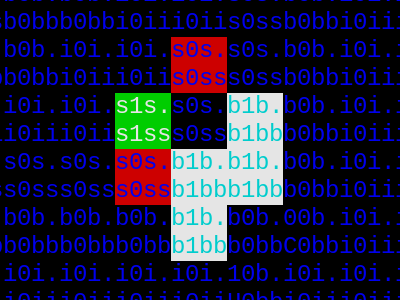

# Zahradnice

fun with type-0 grammars (or something like that)

## Requirements

* ascii
* 8 color terminal
* ncurses
* SDL2_mixer

## Programs

* **flowers**
  * original intention
  * colorful terminal scenery inspired by [Prune](https://apps.apple.com/us/app/prune/id972319818) and [Tree.Bonsai](https://store.steampowered.com/app/875240/Tree_Bonsai/)
* **snake**
  * take on the classic [Snake game genre](https://en.wikipedia.org/wiki/Snake_(video_game_genre))
* **life**
  * quantum version of [Conway's Game of Life](https://en.wikipedia.org/wiki/Conway%27s_Game_of_Life)
* **sokoban**
  * unfinished classic [Sokoban](https://en.wikipedia.org/wiki/Sokoban)
* **high noon**
  * fake ZX Spectrum shoot 'em up [High Noon](https://spectrumcomputing.co.uk/entry/2315/ZX-Spectrum/High_Noon)
* **tetris**
  * just to compare readability and sizes with [tinytetris](https://github.com/taylorconor/tinytetris)

## Grammar

See [GRAMMAR.md](GRAMMAR.md) for grammar programming intro.