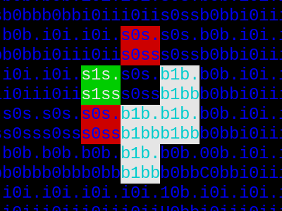

# Zahradnice

fun with type-0 grammars (or something like that)



## Requirements

* ascii
* 8 color terminal
* ncursesw (wide character ncurses)
* SDL2_mixer
* zlib

## Build and run

```sh
make                      # or: make zahradnice-size, for the small binary
./zahradnice              # opens the main menu
./zahradnice programs/life.cfg --seed 42
make test                 # screen dumps, idle CPU, menu behaviour
```

In a menu: `w`/`s` choose, `e` runs, `q` goes back one level (and quits at
the top). A menu re-opens on the entry you left through. `SPACE` pauses
where a program wires it, `F12` writes a screenshot, `ESC` always exits.

## Programs

Access programs through the main menu (`programs/index.cfg`) or run directly:

* **flowers** (`programs/flowers.cfg`)
  * original intention
  * colorful terminal scenery inspired by [Prune](https://apps.apple.com/us/app/prune/id972319818) and [Tree.Bonsai](https://store.steampowered.com/app/875240/Tree_Bonsai/)
* **snake** (`programs/snake/`)
  * take on the classic [Snake game genre](https://en.wikipedia.org/wiki/Snake_(video_game_genre))
* **life** (`programs/life-setup.cfg`)
  * asynchronous version of [Conway's Game of Life](https://en.wikipedia.org/wiki/Conway%27s_Game_of_Life)
* **sokoban** (`programs/sokoban/`)
  * classic [Sokoban](https://en.wikipedia.org/wiki/Sokoban) puzzle game
* **high noon** (`programs/highnoon.cfg`)
  * fake ZX Spectrum shoot 'em up [High Noon](https://spectrumcomputing.co.uk/entry/2315/ZX-Spectrum/High_Noon)
* **tetris** (`programs/tetris/`)
  * just to compare readability and sizes with [tinytetris](https://github.com/taylorconor/tinytetris)
* **zen garden** (`programs/zen.cfg`)
  * meditative visual experience
* **maze for two** (`programs/maze.cfg`)
  * two-player maze game
* **hex** (`programs/hex/`)
  * hex-grid world to walk around
* **primes** (`programs/primes/`)
  * six ways to sieve, below
* **evolution** (`experiments/`)
  * the research programs: forest fire, an evolving forest, a heritable
    trait, a Manna sandpile, a contact process, a petri dish

## Prime sieves

Six programs in `programs/primes/`, ordered by how far the divisor moves out
of the rule set — from a comb per divisor written into the grammar, to a
divisor that is nothing but the height of a band of rows, to two automata
that carry no notion of divisibility at all. The last two are implementations
of published constructions rather than inventions of this repository:

* `01-eratosthenes` — a comb per divisor; magnitude is the screen column
* `02-bands` — a divisor is a band of rows, so a wider terminal sieves further
* `03-counters` — positional counters, one row per divisor, base as a parameter
* `04-packed` — packed static counters; one record costs one rule application
* `05-fischer` — P. C. Fischer, "Generation of Primes by a One-Dimensional
  Real-Time Iterative Array", JACM 12(3) (1965) 388–394. The verdict for *n*
  stands in column 3*n*.
* `06-umeo` — H. Umeo, K. Miyamoto, Y. Abe, "Real-Time Prime Generators
  Implemented on Small-State Cellular Automata", in *Automata, Universality,
  Computation*, ECC vol. 12, Springer 2015, 341–352. Their Fig. 15.7, in
  eight states, one column per number.

Each file is generated by its `tools/gen_primes*.py`; edit the generator, not
the `.cfg`.

## Papers

`paper/` holds five write-ups of experiments run inside this engine, on what a
rewriting system has to pay for before anything in it can be inherited, kept,
or lost.

What they can be trusted for is what they measured. Predictions were
registered before each sweep and scored afterwards including the ones that
failed — the last paper's scoreboard reads eighteen held, seven failed, two
partial, and five of its named laws *are* the failures. Runs are
seed-deterministic and replayed byte-for-byte against their event traces, and
the whole arc required no change to the engine.

They are self-published, and designed and checked by one human–model pair, so
read them as an instrument's log rather than as findings about biology — as
the first paper puts it in its own limits section, reproducing known laws
validates the instrument, not the science. Independent replication means
running the committed scripts.

* *Zahradnice: a Grammar Garden as an Experimental Substrate* — what the
  substrate is, what it costs to ask it a question, and what it cannot model
* *The Subtraction Ladder* — what falls out when ingredients are removed
  one at a time
* *Law Made of Matter* — rules written in the same stuff they act on
* *Machinery That Earns the Channels* — what inheritance costs to acquire
* *What Someone Can Keep* — selection sees only what someone can keep

The repository and its papers are archived at
[10.5281/zenodo.22059784](https://doi.org/10.5281/zenodo.22059784); see
[CITATION.cff](CITATION.cff).

## Grammar

See [GRAMMAR.md](GRAMMAR.md) for the language reference and a programming
intro, [GRAMMAR-pitfalls.md](GRAMMAR-pitfalls.md) for the quirks that bite in
practice, [HEADLESS.md](HEADLESS.md) for driving the engine without a
terminal, and [TRACING.md](TRACING.md) for instrumentation.

## License

Everything here is dedicated to the public domain under
[CC0 1.0](LICENSE) — no conditions. One non-binding request from
the authors: this garden was grown as a commons; if it proves
useful, tend it in that spirit. (Per the repository's own night-10
result, a rule could not enforce this anyway — what persists is
decided by what the commons feeds.)
